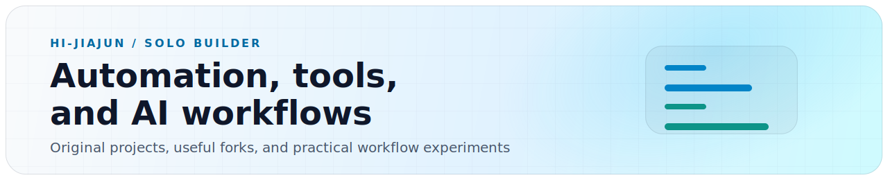

<!-- AUTO-GENERATED FROM README.template.md AND profile-data.yml. DO NOT EDIT DIRECTLY. -->

<picture>
  <source media="(prefers-color-scheme: dark)" srcset="./assets/profile-banner.svg" />
  
</picture>

<h1>Hi, I'm Hi-Jiajun 👋</h1>

🧑‍💻 个人开发者 · Solo builder

  🛠️ 我把 GitHub 当成公开工作台，放自制工具、脚本、实验项目，也放我学习、适配、参考过的 fork。 
  I use GitHub as a public workshop for tools, scripts, experiments, and forks I learn from.

> ℹ️ 这里不是所有仓库都由我从零构建。  
> Some are original, some are forks I use, study, or adapt.

## 关于 About

- 🤖 AI 辅助工作流与 Agent 工具 
  AI-assisted workflows and agent tooling
- 🌐 网络、路由和域名规则相关工具 
  Networking, routing, and domain-rule tooling
- ⚙️ 把重复的日常工作沉淀成脚本和流程 
  Turning repeated work into scripts and workflows
- 🧪 在真实开发和运维场景里测试 AI 工具 
  Testing AI tools in real dev and ops tasks
- 🌱 少堆 demo，多维护真正还在用的项目 
  Fewer half-finished demos, more alive projects
- 🤝 通过 fork、适配，偶尔向上游贡献来学习 
  Learning by forking, adapting, sometimes contributing back

## 🚀 原创 Original Work

<table>
  <tr>
    <td></td>
  </tr>
</table>

## 🤝 Fork · 参考 Forks &amp; References

<table>
  <tr>
    <td></td>
    <td></td>
  </tr>
  <tr>
    <td></td>
    <td></td>
  </tr>
</table>

## 🧰 技术 Stack

  
  
  
  
  
  
  

## 📊 数据 Stats

<table>
  <tr>
    <td>
      
    </td>
    <td>
      
    </td>
  </tr>
</table>

## 💖 赞助 Sponsor

  ☕ 如果这些工具或脚本帮到你，欢迎请我喝杯咖啡 
  If any of these tools or scripts helped you, feel free to buy me a coffee.

<table>
  <tr>
    <td align="center" width="50%"></td>
    <td align="center" width="50%"></td>
  </tr>
</table>

---

  ✨ 先做对自己有用的东西，也希望它们对别人有用。 
  Building things useful to me first, and hopefully useful to others too.

