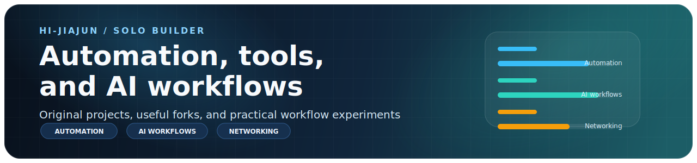

<!--
This file is the source template for README.md.
Do not edit README.md directly; update this template or profile-data.yml instead.
-->

<!-- AUTO-GENERATED FILE: edit README.template.md and profile-data.yml -->

  

  <h1>Hi, I'm Hi-Jiajun 👋</h1>
  
🧑‍💻 个人开发者 / Solo builder

  

    🛠️ 我把 GitHub 当成公开工作台，放一些自己做的小工具、脚本、实验项目，也放一些我会学习、适配和参考的 fork。 
    🛠️ I use GitHub as a public workshop for tools, scripts, experiments, and forks that I learn from or adapt for my own workflow.
  

> ℹ️ 不是这里的每个仓库都由我从零开始构建。  
> ℹ️ Some are original projects, and some are forks I use, study, adapt, or contribute to.

## 👀 About / 关于我

我主要会关注这些方向：  
I am mostly interested in:

- 🤖 AI-assisted workflows and agent tooling / AI 辅助工作流和 Agent 工具
- 🌐 Networking, routing, and domain-rule related tooling / 网络、路由和域名规则相关工具
- ⚙️ Automation for daily work / 日常工作自动化
- 🧰 Small utilities for my own setup / 让自己开发环境更顺手的小工具
- 📚 Open-source projects I can learn from by actually running and modifying them / 通过实际运行和修改来学习的开源项目

## 🔭 Current Focus / 目前关注

- 🔁 Turning repeated manual steps into scripts and repeatable workflows / 把重复步骤沉淀成脚本和可复用流程
- 🧪 Testing AI tools in real development and operations tasks / 在真实开发和运维场景里测试 AI 工具
- 🌱 Keeping a few practical projects alive instead of collecting too many half-finished demos / 少堆 demo，多维护真正还在用的项目
- 🤝 Learning by forking, adapting, and sometimes contributing upstream / 通过 fork、适配和偶尔向上游贡献来学习

## 🚀 Original Work / 原创项目

这些仓库更接近我自己主导或直接维护的内容。  
These repositories are the closest to my own work or direct maintenance.

| Project | Description / 说明 | Activity |
| --- | --- | --- |
| [CN-Domain-Rule-Auto-Generator](https://github.com/Hi-Jiajun/CN-Domain-Rule-Auto-Generator) | Automated generation pipeline for China mainland direct-connect domain rules 中国大陆直连域名规则的自动生成流程 | Python · ⭐ 2 · updated 2026-04-19 |
| [vpp-pppoeclient](https://github.com/Hi-Jiajun/vpp-pppoeclient) | Standalone repository for a VPP PPPoE client plugin extracted from my branch work 从我的分支工作中拆出的 VPP PPPoE Client 独立仓库 | C · ⭐ 2 · updated 2026-04-04 |

## 🤝 Forks, References, Contributions / Fork、参考与贡献

这些仓库会出现在这里，是因为我在使用、学习、适配，或者围绕它们做过一些贡献。  
我不想把它们写成“完全由我原创开发的项目”。  
These repositories are here because I use them, study them, adapt them, or have contributed something around them.

| Project | Why it is here / 为什么会放在这里 | Activity |
| --- | --- | --- |
| [memory-lancedb-pro](https://github.com/Hi-Jiajun/memory-lancedb-pro) | Fork for learning, experimenting, and local adaptation around memory workflows 用于记忆工作流学习、实验和本地适配的 fork | TypeScript · ⭐ 0 · updated 2026-03-28 |
| [pua](https://github.com/Hi-Jiajun/pua) | Fork for studying and adapting agent execution patterns 用于研究和适配 Agent 执行模式的 fork | TypeScript · ⭐ 0 · updated 2026-03-31 |
| [OpenMAIC](https://github.com/Hi-Jiajun/OpenMAIC) | Fork used to explore multi-agent classroom workflows 用于探索多 Agent 课堂工作流的 fork | TypeScript · ⭐ 0 · updated 2026-03-27 |
| [openclaw](https://github.com/Hi-Jiajun/openclaw) | Upstream project I use and study in AI workflow setups 我在 AI 工作流实践里会使用和研究的上游项目 | TypeScript · ⭐ 0 · updated 2026-03-29 |

## 📈 Recently Active / 最近活跃

这部分会根据仓库最近的推送时间自动刷新。  
This section refreshes automatically based on recent repository activity.

| Repository | Status |
| --- | --- |
| [CN-Domain-Rule-Auto-Generator](https://github.com/Hi-Jiajun/CN-Domain-Rule-Auto-Generator) | 🛠️ Original · Automated generation pipeline for China mainland direct-connect domain rules 中国大陆直连域名规则的自动生成流程 updated 2026-04-19 |
| [vpp-pppoeclient](https://github.com/Hi-Jiajun/vpp-pppoeclient) | 🛠️ Original · Standalone repository for a VPP PPPoE client plugin extracted from my branch work 从我的分支工作中拆出的 VPP PPPoE Client 独立仓库 updated 2026-04-04 |
| [pua](https://github.com/Hi-Jiajun/pua) | 🍴 Fork · Fork for studying and adapting agent execution patterns 用于研究和适配 Agent 执行模式的 fork updated 2026-03-31 |
| [openclaw](https://github.com/Hi-Jiajun/openclaw) | 🍴 Fork · Upstream project I use and study in AI workflow setups 我在 AI 工作流实践里会使用和研究的上游项目 updated 2026-03-29 |
| [memory-lancedb-pro](https://github.com/Hi-Jiajun/memory-lancedb-pro) | 🍴 Fork · Fork for learning, experimenting, and local adaptation around memory workflows 用于记忆工作流学习、实验和本地适配的 fork updated 2026-03-28 |

## 🧭 How I Work / 做事方式

- 🧩 I prefer small tools over big promises. / 比起大而空的承诺，我更喜欢小而实用的工具。
- ⚡ I automate repetitive work before polishing it. / 我会先自动化重复劳动，再考虑包装。
- 🔍 I try to keep failures inspectable. / 我希望出问题时能看懂、能定位。
- 🪪 I want repo ownership to be clear. / 我希望仓库归属边界清楚。
- 📝 I use GitHub more as a working notebook than a polished portfolio. / 对我来说，GitHub 更像工作笔记，而不是过度包装的展台。

## 🧰 Toolbox / 常用技术

  
  
  
  
  
  
  

## 📊 Snapshot / GitHub 概览

这里的数据由脚本从 GitHub 仓库信息自动汇总，不依赖第三方统计图片服务。  
These numbers are generated from GitHub repository data by the local script, without relying on third-party stat image services.

  

## ✨ What You Will Find Here / 这里会看到什么

- 🛠️ Original projects I actually build or maintain / 我真的在做、在维护的原创项目
- 🍴 Forks I keep for learning, testing, or adapting / 用来学习、测试和适配的 fork
- ⚙️ Automation-first experiments / 以自动化为核心的小实验
- 📒 Practical scripts and workflow notes / 实用脚本和工作流记录

---

  ✨ 先做对自己有用的东西，也希望它们对别人也有帮助。 
  ✨ Building things that are useful to me first, and hopefully useful to others too.

