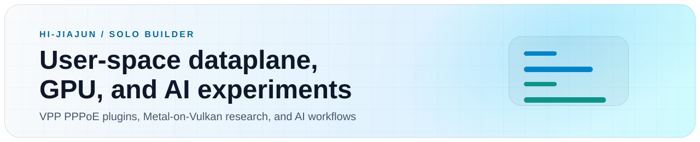

<!-- AUTO-GENERATED FROM README.template.md AND profile-data.yml. DO NOT EDIT DIRECTLY. -->

<picture>
  <source media="(prefers-color-scheme: dark)" srcset="./assets/profile-banner.svg" />
  
</picture>

<h1>Hi, I'm Hi-Jiajun 👋</h1>

🧑‍💻 个人开发者 · 数据面与系统实验 · Solo builder · dataplane & systems experiments

  🛠️ 我把 GitHub 当成公开工作台，在这里维护自己从零写起、而且还在用的项目：用户态网络数据面、系统与 GPU 实验、能省掉重复劳动的 AI 工作流。 
  I use GitHub as a public workbench for the things I build from scratch and still use: user-space dataplane, systems and GPU experiments, and AI workflows that remove repeated work.

> ℹ️ 仓库里既有我从零写的项目，也有学习和适配用的 fork。  
> Some repos are original work; others are forks I study and adapt.

## 关于 About

- 🌐 用户态数据面：FD.io VPP 的 PPPoE 插件，从协议状态机做到性能验证 
  User-space dataplane: a PPPoE plugin for FD.io VPP, from protocol state machine to performance benchmarks
- 🧪 系统与 GPU 实验：在 Vulkan 上复刻 Metal 计算 API，对比行为与精度差异 
  Systems and GPU experiments: reproducing the Metal compute API on Vulkan and comparing parity
- 🤖 AI 工作流：Agent 工具、MCP 集成，把重复劳动写成脚本 
  AI workflows: agent tooling, MCP integration, and scripting away repeated work
- 🤝 靠 fork、适配，偶尔给上游提 PR 来学习 
  Learning by forking, adapting, and sending the occasional upstream PR

## 🚀 原创项目 Original Projects

<table>
  <tr>
    <td></td>
    <td></td>
  </tr>
</table>

## 🧰 技术 Stack

  <picture>
    <source media="(prefers-color-scheme: dark)" srcset="https://img.shields.io/badge/C-VPP%20plugins-0D1B2A?labelColor=0D1B2A&style=flat&logo=c&logoColor=38BDF8" />
    
  </picture>
  <picture>
    <source media="(prefers-color-scheme: dark)" srcset="https://img.shields.io/badge/Rust-systems%20prototypes-0D1B2A?labelColor=0D1B2A&style=flat&logo=rust&logoColor=F59E0B" />
    
  </picture>
  <picture>
    <source media="(prefers-color-scheme: dark)" srcset="https://img.shields.io/badge/Python-tooling-0D1B2A?labelColor=0D1B2A&style=flat&logo=python&logoColor=38BDF8" />
    
  </picture>
  <picture>
    <source media="(prefers-color-scheme: dark)" srcset="https://img.shields.io/badge/Node.js-scripts-0D1B2A?labelColor=0D1B2A&style=flat&logo=nodedotjs&logoColor=2DD4BF" />
    
  </picture>
  <picture>
    <source media="(prefers-color-scheme: dark)" srcset="https://img.shields.io/badge/GitHub%20Actions-automation-0D1B2A?labelColor=0D1B2A&style=flat&logo=githubactions&logoColor=38BDF8" />
    
  </picture>
  <picture>
    <source media="(prefers-color-scheme: dark)" srcset="https://img.shields.io/badge/OpenClaw-workflow%20experiments-0D1B2A?labelColor=0D1B2A&style=flat" />
    
  </picture>
  <picture>
    <source media="(prefers-color-scheme: dark)" srcset="https://img.shields.io/badge/MCP-tool%20integration-0D1B2A?labelColor=0D1B2A&style=flat" />
    
  </picture>
  <picture>
    <source media="(prefers-color-scheme: dark)" srcset="https://img.shields.io/badge/Browser%20Automation-experiments-0D1B2A?labelColor=0D1B2A&style=flat" />
    
  </picture>
  <picture>
    <source media="(prefers-color-scheme: dark)" srcset="https://img.shields.io/badge/WSL-windows%20workflows-0D1B2A?labelColor=0D1B2A&style=flat&logo=windowsterminal&logoColor=F59E0B" />
    
  </picture>

## 📊 数据 Stats

<table>
  <tr>
    <td>
      <picture>
  <source media="(prefers-color-scheme: dark)" srcset="https://github-readme-stats-rosy-two.vercel.app/api?username=Hi-Jiajun&show_icons=true&include_all_commits=true&count_private=false&hide_border=true&border_radius=16&card_width=480&bg_color=0D1B2A&title_color=38BDF8&text_color=F8FAFC&icon_color=2DD4BF" />
  
</picture>
    </td>
    <td>
      <picture>
  <source media="(prefers-color-scheme: dark)" srcset="https://github-readme-activity-graph.vercel.app/graph?username=Hi-Jiajun&hide_border=true&radius=16&area=true&bg_color=0D1B2A&color=F8FAFC&title_color=38BDF8&line=38BDF8&point=2DD4BF&area_color=38BDF8" />
  
</picture>
    </td>
  </tr>
</table>

 

<picture>
  <source media="(prefers-color-scheme: dark)" srcset="https://github-readme-stats-rosy-two.vercel.app/api/top-langs/?username=Hi-Jiajun&layout=compact&hide_border=true&border_radius=16&card_width=976&langs_count=8&bg_color=0D1B2A&title_color=38BDF8&text_color=F8FAFC" />
  
</picture>

## 💖 赞助 Sponsor

  ☕ 如果这些工具或脚本帮到你，欢迎请我喝杯咖啡 
  If any of these tools or scripts helped you, feel free to buy me a coffee.

<table>
  <tr>
    <td align="center" width="50%"></td>
    <td align="center" width="50%"></td>
  </tr>
</table>

---

  ✨ 先做对自己有用的东西，也希望它们对别人有用。 
  Building things useful to me first, and hopefully useful to others too.

